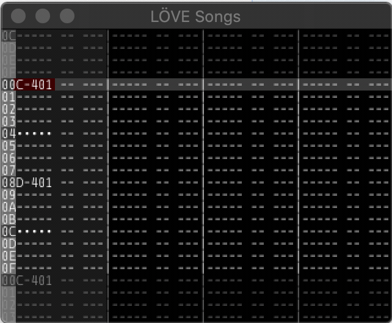

# LÖVE Songs

I wanted to make love2d-based mod-tracker for a pi-zero inisde a [gameboy case](http://retroflag.com/GPi-CASE.html). It has a focus on using a joystick (dpad and 8 buttons) to make songs easily on my hardware. Eventually, it will have modern features like realtime effects and midi support. Think "renoise for a tiny screen & joystick.)



I have tested on LÖVE 11.3 (Mysterious Mysteries.) It may work elsewhere, but I haven't tested it.

I installed retropie, basic hardware drivers & optional retropie love-support, and then save the love file in the right location (`~/RetroPie/roms/love`) and it shows up in the menu.

## Usage

My device has these buttons:

```
A
B
X
Y
start
select
L
R
dpad up/down/left/right
```

So everything is based on this, even if you have a keyboard. The mappings for desktop-use are similar to what you might find in a SNES emulator:

```
Z
X
A
S
enter
escape
PageUp
PageDown
arrow up/down/left/right
```

They will be referred to by their controller-names.

You can also use a XBOX 360/ONE or PS3/4 controller, and it should work the same (directional is DPAD.)

It will probly seem a bit complicated at first, but once you get the hang of it, it will make editing music go pretty fast. It will help you print yourself a [cheat-sheet](NOT AVAILABLE).

### global

* `select` + `start` is "exit" There is no confirmation, so be careful of this one
* in menus, `A` is "yes" and `B` is "cancel"
* in menus, `dpad` `up/down` is for selecting options
* Press `L`/`R` to swap through different modes (pattern/instrument/song/jam)
* `start` is global "play" or "edit".


While playing, you won't hear changes until that part of the sequence is played (so you live-squence stuff a bit ahead of what's currently playing) but in edit mode, you will here it.

### pattern

If you are playing, you can't edit notes, and the current-line will follow the song. Columns are `NOTE, INSTRUMENT, EFFECT` in each track.

* If you are editing, `dpad` move selector around the pattern.
* `B` and `dpad` `up/down` to switch current pattern
* `B` and `dpad` `left/right` to switch current instrument
* `A` and `dpad` `up/down` to change note
* `X` and `dpad` `up/down` to change note, by octave
* `Y` and `dpad` `up/down` to cycle through effects
* `Y` and `dpad` `left/right` to chnage effect value

* `A`+`select` is "copy pattern"
* `A`+`start` is "paste pattern"

* `Y`+`select` is "copy row"
* `Y`+`start` is "paste row"

* `X`+`select` is "copy track"
* `X`+`start` is "paste track"

## instrument

This is where you setup your instruments for sequencing pattern mode.

## song

This is where you set the order of patterns to be played & chnage the overall mode to pattern (single patterns at a time) or song (play the whole sequence.)

### jam

This mode is for live-triggering samples. You can preset buttion+`dpad` (in a grid) combos to play different samples, and use it kind of like a drum-pad. It will work if your song/pattern is playing, or not (for standalone sampler-pads.) Since it is all tied to a single instrument, you'll have to setup your sameples to work well. Changes made here effect the rest of the instrument so it can also be used as a faster way to try out your instrument-mappings.


**TODO** lots more to come, here

## Development

Run `make` then one of these targets:

```
help                           show this help
run                            run the current project
clean                          delete all output files
build                          build distributables for everyone in dist/
```

You will need `love` in your path.

On OSX, put this in your `~/.bashrc`:

```
alias love="open -a love"
```

## TODO

This is a lot of work, and there is only me working on it, so I'm doing things in stages.

### stage 0

This is basic demo phase. It doesn't really work, but sort of shows how the UI will operate, eventually.

* 4 tracks
* 16-note patterns
* dialog for instruments
* dialog for samples
* dialog for file load/save song and set BPM
* denmo pattern/instrument/song/jam modes 
* play/edit

### stage 1

This is basic tracker usability. It should handle all the basic fatures that FT2 or OpenMPT have, but with the contraints above (4/16 patterns.)
* basic classic mod effects
* actually play * edit patterns
* make all the dialogs actually work
* config files for themes & settings
* song sequencing that works
* load/save at very least mod (but XM/IT/S3M will be needed for more tracks and other features)


# stage 2

This is where I start to expand on what original xm/s3m/it format can do, and expand beyond what my lil gameboy thing needs. I might not do all of these, just some ideas.

* as many tracks as you like (with scrolling in editor)
* as many notes in pattern as you like  (with scrolling in editor)
* renoise-like extended effects (ladspa/lv2)
* midi learn & in/out support
* midi recording & live-play
* mouse/extended-keyboard support, in a special mode (make it more like a classic tracker, if you have peripherals & turn on that mode)
* higher-resolution support
* multi-player: several people with joysticks can control different parts (for exmaple set one as "editor" and others as jammers on different instruments)
* split-screen multiplayer: many players can use a portion of the screen with their own controllers